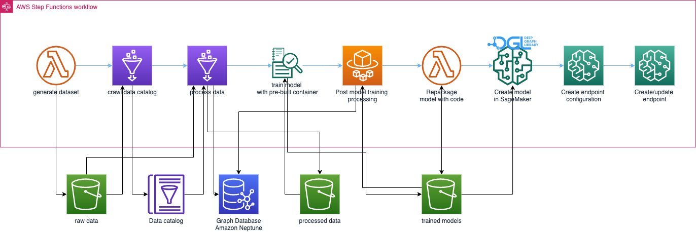
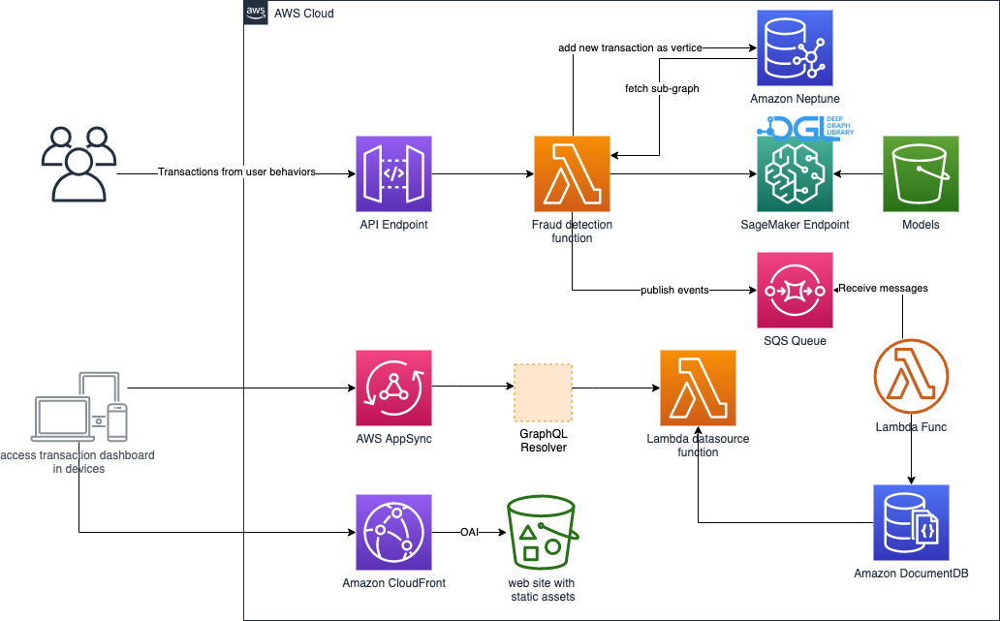

# Real-time Fraud Detection with Graph Neural Network on DGL

It's a end-to-end solution for **real-time** fraud detection using graph database [Amazon Neptune][neptune], [Amazon SageMaker][sagemaker] and [Deep Graph Library (DGL)][dgl] to construct a heterogeneous graph from tabular data and train a Graph Neural Network(GNN) model to detect fraudulent transactions in the [IEEE-CIS Fraud detection dataset][ieee-fraud-detection].

## Architecutre of solution

This solution consists of below [stacks][cfn-stack],

- Fraud Detection solution stack
- nested model training and deployment stack
- nested real-time fraud detection stack
- nested transaction dashboard stack

### Model training and deployment stack

The model training & deployment pipeline is orchestrated by [AWS Step Functions][step-functions] like below graph,


### Dashboard stack

It creates a React based web portal that observes the recent fraud transactions detected by this solution. This web application also is orchestrated by [Amazon CloudFront][cloudfront], [AWS Amplify][amplify], [AWS AppSync][appsync], [Amazon API Gateway][api], [AWS Step Functions][step-functions] and [Amazon DocumentDB][docdb].


#### How to train model and deploy inference endpoint

After [deploying](#how-to-deploy-the-solution) this solution, go to AWS Step Functions in AWS console, then start the state machine starting with `ModelTrainingPipeline`.

You can input below parameters to overrride the default parameters of model training,

```json
{
  "trainingJob": {
    "hyperparameters": {
    "n-hidden": "64",
    "n-epochs": "100",
    "lr":"1e-3"
    },
    "instanceType": "ml.c5.9xlarge",
    "timeoutInSeconds": 10800    
  }
}
```

## How to deploy the solution

### Regions

The solution is using graph database [Amazon Neptune][neptune] for real-time fraud detection and [Amazon DocumentDB][docdb] for dashboard. Due to the availability of those services, the solution supports to be deployed to below regions,

- US East (N. Virginia):   us-east-1
- US East (Ohio):   us-east-2
- US West (Oregon):   us-west-2
- Canada (Central):   ca-central-1
- South America (São Paulo):   sa-east-1
- Europe (Ireland):   eu-west-1
- Europe (London):   eu-west-2
- Europe (Paris):   eu-west-3
- Europe (Frankfurt):   eu-central-1
- Asia Pacific (Tokyo):   ap-northeast-1
- Asia Pacific (Seoul):   ap-northeast-2
- Asia Pacific (Singapore):   ap-southeast-1
- Asia Pacific (Sydney):   ap-southeast-2
- Asia Pacific (Mumbai):   ap-south-1
- China (Ningxia):   cn-northwest-1

### Prerequisites

- An AWS account
- Configure [credential of aws cli][configure-aws-cli]
- Install node.js LTS version, such as 12.x
- Install Docker Engine
- Install the dependencies of solution via executing command `yarn install && npx projen`
- Initialize the CDK toolkit stack into AWS environment(only for deploying via [AWS CDK][aws-cdk] first time), run `yarn cdk-init`
- [Optional] [Public hosted zone in Amazon Route 53][create-public-hosted-zone]
- Authenticate with below ECR repository in your AWS partition
```shell
aws ecr get-login-password --region us-east-1 | docker login --username AWS --password-stdin 763104351884.dkr.ecr.us-east-1.amazonaws.com
```
Run below command if you are deployed to China regions
```shell
aws ecr get-login-password --region cn-northwest-1 | docker login --username AWS --password-stdin 727897471807.dkr.ecr.cn-northwest-1.amazonaws.com.cn
```

### Deploy it in a new VPC
The deployment will create a new VPC acrossing two AZs at least and NAT gateways. Then the solution will be deployed into the newly created VPC.
```shell
yarn deploy
```

### Deploy it into existing VPC
If you want to deploy the solution to default VPC, use below command.
```shell
yarn deploy-to-default-vpc
```
Or deploy an existing VPC by specifying the VPC Id,
```shell
npx cdk deploy -c vpcId=<your vpc id>
```

**NOTE: please make sure your existing VPC having both public subnets and private subnets with NAT gateway.**

### Deploy it with custom Neptune instance class and replica count

The solution will deploy Neptune cluster with instance class `db.r5.8xlarge` and `1` read replica by default. You can override the instance class and replica count like below,

```shell
npx cdk deploy --parameters NeptuneInstaneType=db.r5.12xlarge -c NeptuneReplicaCount=2 
```

### Deploy it with custom domain of dashboard

If you want use custom domain to access the dashbaord of solution, you can use below options when deploying the solution. NOTE: you need already create a public hosted zone in Route 53, see [Solution prerequisites](#prerequisites) for detail.
```shell
npx cdk deploy -c EnableDashboardCustomDomain=true --parameters DashboardDomain=<the custom domain> --parameters Route53HostedZoneId=<hosted zone id of your domain>
```

### Deploy it to China regions
Add below additional context parameters,
```shell
npx cdk deploy -c TargetPartition=aws-cn
```
**NOTE**: deploying to China region also require below domain parameters, because the CloudFront distribution must be accessed via custom domain.
```shell
--parameters DashboardDomain=<the custom domain> --parameters Route53HostedZoneId=<hosted zone id of your domain>
```

## How to test
```shell
yarn test
```

## Data engineering/scientist
There are [Jupyter notebooks](./src/sagemaker/) for data engineering/scientist playing with the data featuring, model training and deploying inference endpoint without deploying this solution.

## FAQ
TBA

## Security

See [CONTRIBUTING](CONTRIBUTING.md#security-issue-notifications) for more information.

## License

This project is licensed under the Apache-2.0 License.

[dgl]: https://www.dgl.ai/
[neptune]: https://aws.amazon.com/neptune/
[sagemaker]: https://aws.amazon.com/sagemaker/
[cloudfront]: https://aws.amazon.com/cloudfront/
[amplify]: https://aws.amazon.com/amplify/
[appsync]: https://aws.amazon.com/appsync/
[docdb]: https://aws.amazon.com/documentdb/
[api]: https://aws.amazon.com/api-gateway/
[step-functions]: https://aws.amazon.com/stepfunctions/
[ieee-fraud-detection]: https://www.kaggle.com/c/ieee-fraud-detection/
[configure-aws-cli]: https://docs.aws.amazon.com/zh_cn/cli/latest/userguide/cli-chap-configure.html
[aws-cdk]: https://aws.amazon.com/cdk/
[cfn-stack]: https://docs.aws.amazon.com/AWSCloudFormation/latest/UserGuide/stacks.html
[create-public-hosted-zone]: https://docs.aws.amazon.com/Route53/latest/DeveloperGuide/CreatingHostedZone.html