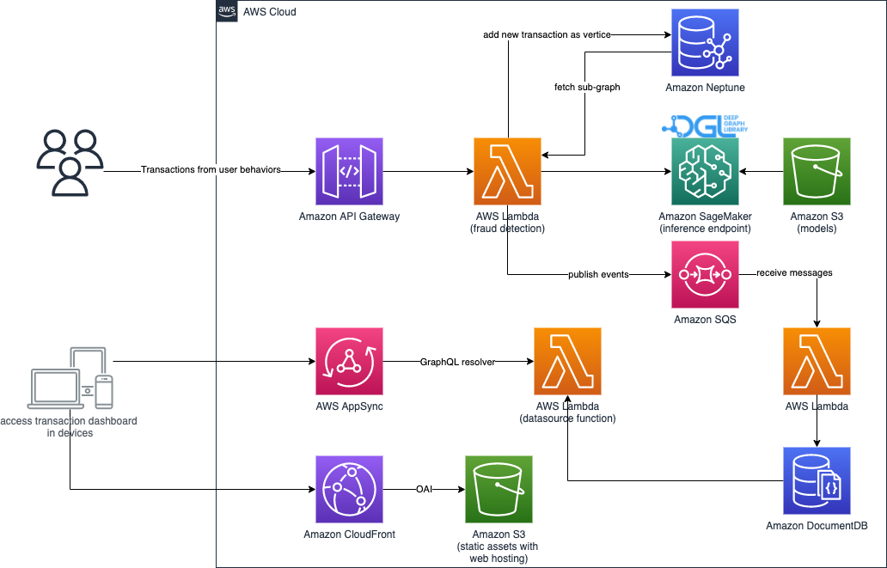

Deploying this solution with the default parameters builds the following environment in the AWS Cloud.

      
Figure 1：architecture of construct graph data, model training and model deployment

Figure 2：architecture of real-time fraud detection and business monitor system

This solution deploys five AWS CloudFormation templates in your AWS account and sets up the following:

1. The first AWS CloudFormation template `realtime-fraud-detection-with-gnn-on-dgl` creates:
    - an [Amazon Virtual Private Cloud][vpc] (Amazon VPC) running a [NAT gateway][nat-gateway], and an [internet gateway][igw].
    - a Graph database [Amazon Neptune][neptune] cluster with one read replica，the default instance size is `db.r5.xlarge`.
    - an [Amazon SQS][sqs] message queue。
2. The second CloudFormation template starting with `realtime-fraud-detection-with-gnn-on-dgl-trainingNestedStack` creates:
    - an [AWS Step Functions][step-functions] workflow pipeline trains the model from tabular finance trasaction dataset, then deploy the online infernce endpoint.
    - [AWS Glue][glue] data catalog and ETL job are used transforming the original tabular data to graph structure data.
    - [Amazon ECS][ecs] on [AWS Fargate][fargate] import the graph data into graph database Amazon Neptune.
    - [Amazon SageMaker][sagemaker] trains model and deploy the online inference endpoint.
    - [AWS Lambda][lambda] functions implement raw data ingesting, post-processing after model training and other glue work.
3. The third CloudFormation template starting with `realtime-fraud-detection-with-gnn-on-dgl-inferenceNestedStack` creates:
    - AWS Lambda function implements the real-time fraud detection endpoint.
4. The fourth CloudFormation tempalte starting with `realtime-fraud-detection-with-gnn-on-dgl-dashboardNestedStack` creates: 
    - [Amazon DocumentDB][documentdb] stores the transactions and their properties, its credential is saved in [AWS Secrets Manager][secrets-manager].
    - [AWS Lambda][lambda] function receives the real-time online trasactions and stores in DocumentDB.
    - the business dashboard website hosting in [Amazon S3][s3] and distributed by [Amazon CloudFront][cloudfront].
    - the backend of business dashboard consits of [Amazon API Gateway][api-gateway] and [AWS AppSync][appsync].
5. The fifth CloudFormation template starting with `realtime-fraud-detection-with-gnn-on-dgl-DashboardDatabaseRotation` creates:
    - [AWS Lambda][lambda] function will periodically rotate the user credential of DocumentDB stored in Secrets Manager.

For redundancy, the Amazon VPCs are created with subnets in two Availability Zones (AZs) for high availability. The NAT gateway, Amazon Neptune, Amazon DocumentDB, AWS Glue and other AWS resources are deployed across these two AZs.

> **NOTE**:
> AWS CloudFormation resources are created from AWS Cloud Development Kit (CDK) (AWS CDK) constructs.

[vpc]: https://aws.amazon.com/en/vpc/
[nat-gateway]: https://docs.aws.amazon.com/vpc/latest/userguide/vpc-nat-gateway.html
[igw]: https://docs.aws.amazon.com/vpc/latest/userguide/VPC_Internet_Gateway.html
[neptune]: https://aws.amazon.com/en/neptune/
[sqs]: https://aws.amazon.com/en/sqs/
[step-functions]: https://aws.amazon.com/en/step-functions/
[glue]: https://aws.amazon.com/en/glue/
[ecs]: https://aws.amazon.com/en/ecs/
[fargate]: https://aws.amazon.com/en/fargate/
[sagemaker]: https://aws.amazon.com/en/sagemaker/
[lambda]: https://aws.amazon.com/en/lambda/
[documentdb]: https://aws.amazon.com/en/documentdb/
[s3]: https://aws.amazon.com/en/s3/
[cloudfront]: https://aws.amazon.com/en/cloudfront/
[api-gateway]: https://aws.amazon.com/en/api-gateway/
[appsync]: https://aws.amazon.com/en/appsync/
[secrets-manager]: https://aws.amazon.com/en/secrets-manager/